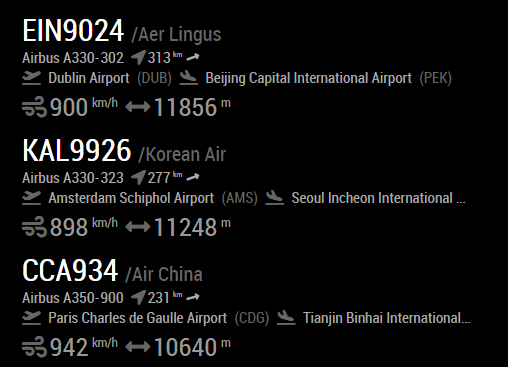

# MMM-FlightRadarTracker

`MMM-FlightRadarTracker` is a module for [MagicMirror](https://github.com/MichMich/MagicMirror) that allows you to display
real time information about nearby planes using data retrieved from [flightradar24](https://www.flightradar24.com). This module borrows major parts from tbouron's excellent [MMM-FlightTracker](https://github.com/tbouron/MMM-FlightTracker), but is meant for those that don't have an ADS-B receiver and want to use flightradar24 data instead.



### Setup

Clone this module into your MagicMirror's `modules` directory and install the dependencies:

```sh
cd modules
git clone https://github.com/jesmak/MMM-FlightRadarTracker
cd MMM-FlightRadarTracker
npm install
```

then add the module to your MagicMirror's configuration. Here is an example:

```javascript
/* MagicMirror/config/config.js */
{
    /* ...your other config here */

    modules: [

        /* ...your other modules here */

        {
            module: 'MMM-FlightRadarTracker',
            header: 'Nearby planes',
            position: 'top_left',
            config: {
                updateInterval: Number,
                distance: Number,
                passingByThreshold: Number,
                limit: Number,
                speedUnits: 'metric|imperial|knots',
                altitudeUnits: 'metric|imperial',
                centerPoint: [60.168489, 24.939830],
                showAirline: Boolean,
                showType: Boolean,
                showSpeed: Boolean,
                showAltitude: Boolean,
                showHeading: Boolean,
                showDirectionAsArrow: Boolean,
                showRoute: Boolean,
                noPlanesLabel: String,
                atTheWindowLabel: String,
                passingByLabel: String,
		sort: 'distance|speed|altitude|flight|airline',
		sortDescending: Boolean
            }
        }
    ]
}
```

### Configuration options

| Configuration key | Description | Default | Required |
| --- | --- | --- | --- |
| updateInterval | Interval to check if new planes are nearby. This value is in _seconds_. | `180` | Yes |
| passingByThreshold | The threshold altitude to determine if a plane is "at the window" or just "passing by". If no set (or negative) then all planes will be treated the same way. | `-1` | No |
| centerPoint | Your current coordinates, as an `Array` of `Number`. E.g. `[60.168489, 24.939830]`. | `[60.168489, 24.939830]` | Yes |
| distance | Distance in kilometers from the center point. Planes that are inside this range are shown. | `60` | Yes |
| limit | Limit the number of planes to display. If negative, then all tracked planes are displayed. | 5 | No |
| speedUnits | The unit to use for speed. By default, it will use the unit defined at the global config. Can be `metric`, `imperial` or `knots`. | Global unit config | No |
| altitudeUnits | The unit to use for altitude and distance to the plane (if `latLng` is defined). By default, it will use the unit defined at the global config. Can be `metric` or `imperial`. | Global unit config | No |
| showAirline | Whether or not show the airline for each flight, if available. | `true` | No |
| showType | Whether or not show the aircraft type for each flight, if available. | `true` | No |
| showSpeed | Whether or not show the aircraft speed for each flight, if available. | `true` | No |
| showAltitude | Whether or not show the aircraft altitude for each flight, if available. | `true` | No |
| showHeading | Whether or not show the aircraft heading for each flight, if available. | `true` | No |
| showDirectionAsArrow | Whether to show aircraft direction as an arrow. If false, use text, E.g. `NE`instead. | `true` | No |
| showRoute | Whether to origin and destination of the aircraft. | `true` | No |
| noPlanesLabel | Text to show when there are no planes inside the defined area. | `No planes nearby` | No |
| atTheWindowLabel | Subtitle to show for planes that are at the window. | `At the window` | No |
| passingByLabel | Subtitle to show for planes that are passing by. | `Passing by` | No |
| sort | The field used for sorting the list. Can be `distance`, `speed`, `altitude`, `flight` or `airline`. | `distance` | No |
| sortDescending | Whether to sort the items in descending order. | `false` | No |
